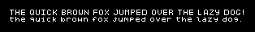
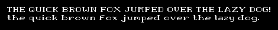

# pixelfont-image

Generate PNG images of text using [pixelfont](https://github.com/sleepinginsomniac/pixelfont)





## Installation

```sh
brew install crystal
shards install
shards build --release
```

## Usage

```sh
./bin/pixelfont-image -f lib/pixelfont/fonts/pixel-9x11 -o fonts-pixel-9x11.png $'0123456789\nABCDEFGHIJKLMNOPQRSTVWXYZ\nabcdefghijklmnopqrstuvwxyz'
```

## Contributing

1. Fork it (<https://github.com/sleepinginsomniac/pixelfont-image/fork>)
2. Create your feature branch (`git checkout -b my-new-feature`)
3. Commit your changes (`git commit -am 'Add some feature'`)
4. Push to the branch (`git push origin my-new-feature`)
5. Create a new Pull Request

## Contributors

- [Alex Clink](https://github.com/sleepinginsomniac) - creator and maintainer
